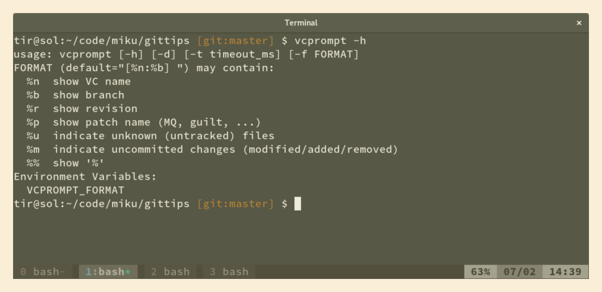

## 2. Prompt playsi

Spice up your prompt. Saves you an occasional git status. There are many versions:

* [git-prompt.sh](https://github.com/git/git/blob/master/contrib/completion/git-prompt.sh)
* [zsh-git-prompt](https://github.com/olivierverdier/zsh-git-prompt)
* [bash-git-prompt](https://github.com/magicmonty/bash-git-prompt)

### vcprompt



```shell
fancyprompt ()
{
    command -v vcprompt > /dev/null 2>&1;
    if [ $? -eq 0 ]; then
        export PS1="\u@\h:\w \[$COLOR256_130\]\$(vcprompt -f '[%n:%b%u%m] ')\[$RESET\]\$ ";
    else
        defaultprompt;
    fi
}
```
