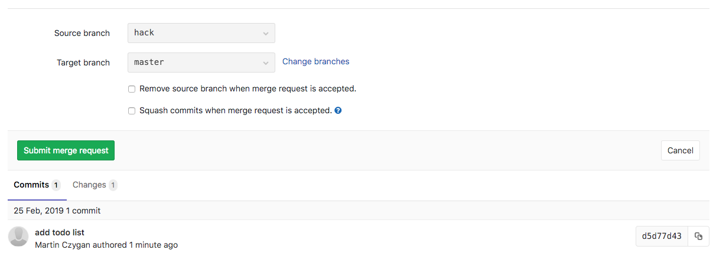
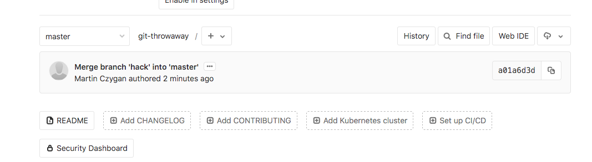

## 4. Edit, patch, rebase

A few thoughts on edit, patch and rebase.


### Know about git add --patch

You don't have to use it, just know about it.

```
$ git add --patch 
```

It allows to interactively select hunks for a commit. Useful to craft
semantically sensible commits, e.g. separate updates to documentation from a
fix, from a feature.

Works for `git reset --patch`, too.

Shorthand: `git add -p`, in essence, you can have a mess of changes and your
commits still look fantastic.

### Rebase

Seems to be the most irritating thing. It has two broad use cases:

* reorganize your own work
* follow a more linear commit history

#### Reorganize your work

A most basic scenario:

* branch off master
* hack on things
* commit, commit, commit - dirty, ugly commits, no messages, totally insane
* it seems to work
* interactively rebase
* people will think you are a genius, coming up with clean solutions from the start

Maybe try it out:

Dummy repo at
[https://git.informatik.uni-leipzig.de/czygan/git-throwaway](https://git.informatik.uni-leipzig.de/czygan/git-throwaway).

```shell
$ git clone git@git.informatik.uni-leipzig.de:czygan/git-throwaway.git
```

TODO:

* Clone the repo
* Create some branch
* Create three commits
* Combine these commits into one

#### Linear history

By default, each Merge Request is actually a merge.



The Fast-Forward option needs to be explicitly enabled:

* [Enabling fast-forward
  merges](https://docs.gitlab.com/ee/user/project/merge_requests/fast_forward_merge.html)

> When a fast-forward merge is not possible, the user is given the option to
> rebase.


