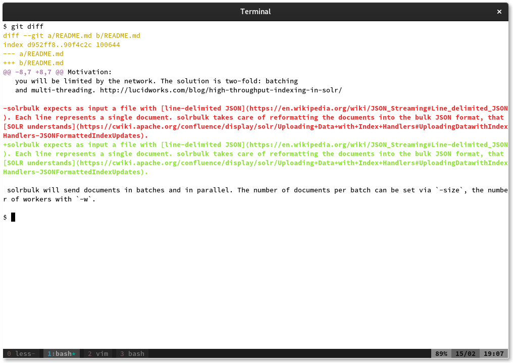
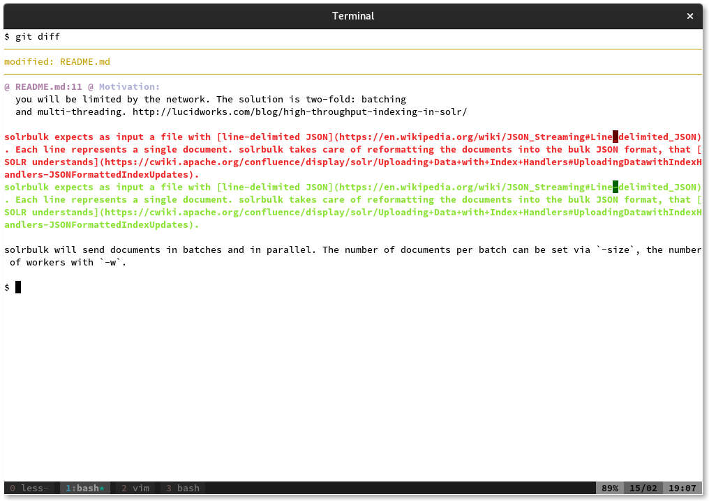
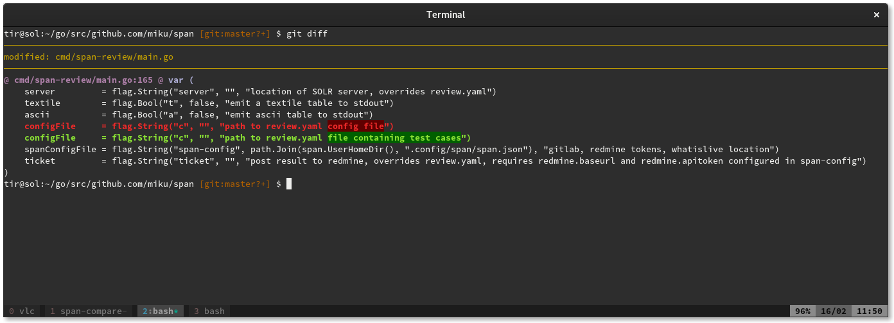

## Diff-so-fancy

The default is NICE, but can you spot the difference?

But we can get [FANCY](https://github.com/so-fancy/diff-so-fancy) as well (just
drop [this Perl
script](https://raw.githubusercontent.com/so-fancy/diff-so-fancy/master/third_party/build_fatpack/diff-so-fancy)
into your PATH):

Dark themed:

