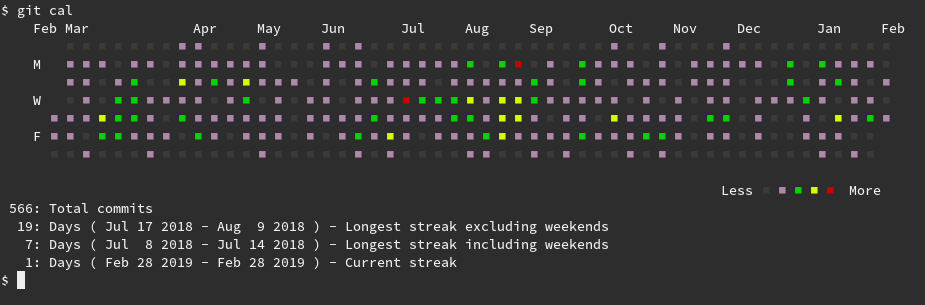
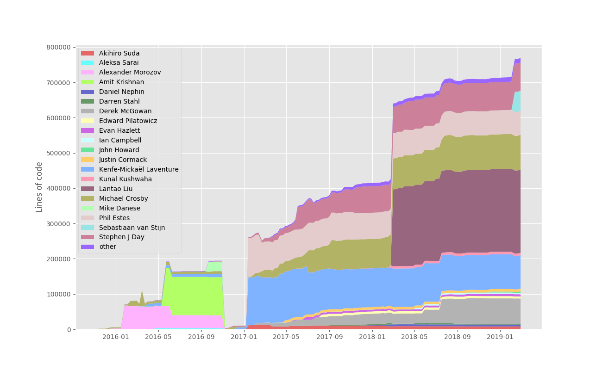
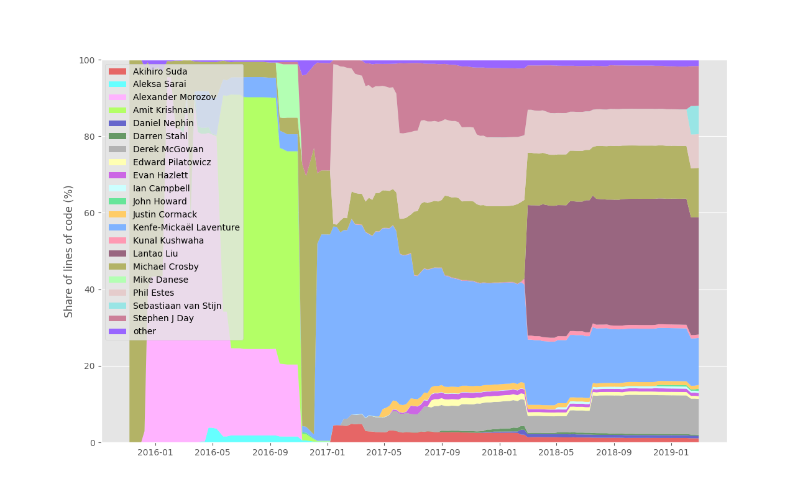
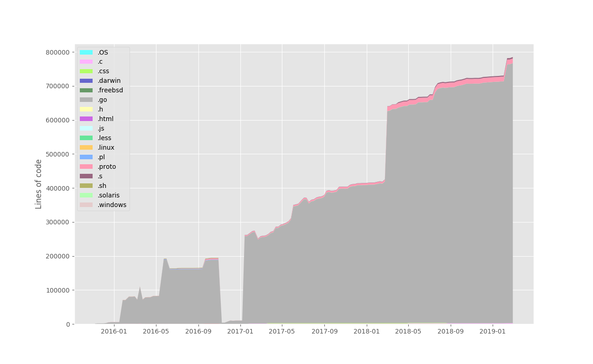
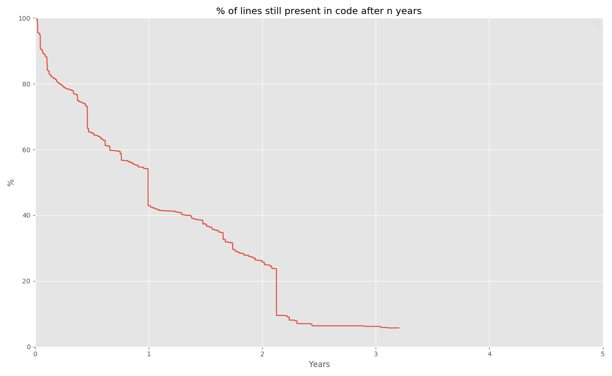

## Stats

[Install](https://github.com/tj/git-extras/blob/master/Installation.md)
[git-extras](https://github.com/tj/git-extras) to get a few additional tools.
Here, `git summary` on git:

```
$ git summary

 project  : git
 repo age : 14 years
 active   : 4788 days
 commits  : 54455
 files    : 3533
 authors  :
 20215  Junio C Hamano                  37.1%
  3047  Jeff King                       5.6%
  1612  Nguyễn Thái Ngọc Duy            3.0%
  1401  Shawn O. Pearce                 2.6%
  1324  Johannes Schindelin             2.4%
  1116  Linus Torvalds                  2.0%
   954  Michael Haggerty                1.8%
   842  René Scharfe                    1.5%
   819  Jonathan Nieder                 1.5%
   614  Stefan Beller                   1.1%
   569  Ævar Arnfjörð Bjarmason         1.0%
   547  Christian Couder                1.0%
   545  Eric Wong                       1.0%

```

### git-cal

Command line activity view via [git-cal](https://github.com/k4rthik/git-cal).




### Git-of-Theseus

Have you heard of [git-of-theseus](https://github.com/erikbern/git-of-theseus)?

> As a project evolves, does the new code just add on top of the old code? Or
> does it replace the old code slowly over time? In order to understand this, I
> built a little thing to analyze Git projects, with help from the formidable
> GitPython project. The idea is to go back in history historical and run a git
> blame (making this somewhat fast was a bit nontrivial, as it turns out, but
> I’ll spare you the details, which involve some opportunistic caching of
> files, pick historical points spread out in time, use git diff to invalidate
> changed files, etc).


```shell
$ pip install git-of-theseus
$ git-of-theseus-analyze .
...
Counting total entries to analyze + caching filenames
Analyzing commit history
100% (1488 of 1488) |
...
Writing cohort data to ./cohorts.json
Writing ext data to ./exts.json
Writing author data to ./authors.json
Writing survival data to ./survival.json
```

Create stack or survival plots:

```
$ git-of-theseus-stack-plot authors.json
$ open stack_plot.png
```

### Analyzing a [random](https://github.com/containerd/containerd) git repo

Let's peek into containerd:

> An industry-standard container runtime with an emphasis on simplicity, robustness and portability

#### Authors



#### Authors (normalized)



#### Code cohorts


#### File extensions



#### Code survival



#### Makefile

Simple [makefile](static/got-containerd/Makefile) used to create plots:

```makefile
# Generic makefile to analyze a git repository and generate some plots.
REPO = $(HOME)/go/src/github.com/containerd/containerd


.PHONY: analyze all

all: analyze
	git-of-theseus-stack-plot --outfile authors.png authors.json
	git-of-theseus-stack-plot --normalize --outfile authorsnorm.png authors.json
	git-of-theseus-stack-plot --outfile exts.png exts.json
	git-of-theseus-stack-plot --outfile cohorts.png cohorts.json
	git-of-theseus-survival-plot --outfile survival.png survival.json

analyze:
	git-of-theseus-analyze $(REPO)
```

### Example from another project at [@UBL](http://ub.uni-leipzig.de/)

* [Cohorts](https://github.com/miku/siskin/blob/master/docs/repo/cohorts.png)
  for project [siskin](https://github.com/miku/siskin).
