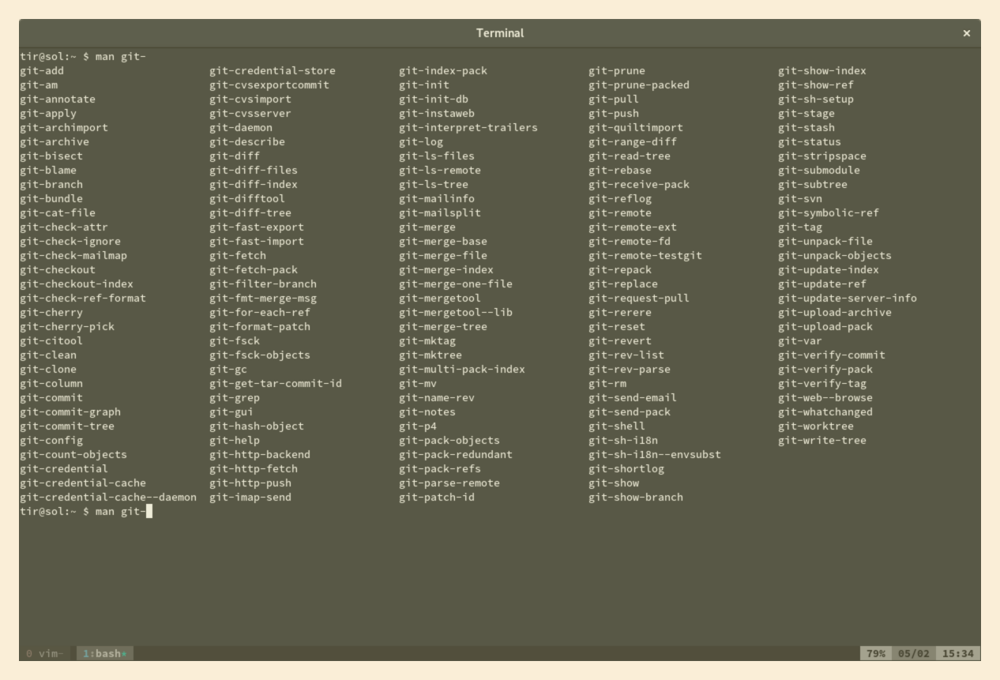

# Git Love

Git is a lovely tool. This repo collects a few things I found useful.

Prepared for 2019-02-25, 12:30--13:30 meeting.

## TOC

1. Git is a toolkit
2. Prompt playsi
3. Config bits
4. Edit, Patch, Rebase
5. The Clash
6. Local hooks
7. The git push workflow (remote hooks)
8. Stats (cal, theseus)

----

## 1. git is a toolkit

Git is a collection of utilities, just a normal UNIX citizen.



* [https://git.kernel.org/pub/scm/git/git.git/about/](https://git.kernel.org/pub/scm/git/git.git/about/)

It became self-hosting within two weeks.

```shell
$ git clone https://git.kernel.org/pub/scm/git/git.git && cd git
$ git log --reverse | head -5
commit e83c5163316f89bfbde7d9ab23ca2e25604af290
Author: Linus Torvalds <torvalds@ppc970.osdl.org>
Date:   Thu Apr 7 15:13:13 2005 -0700

    Initial revision of "git", the information manager from hell

```

See: It's from hell and it started with a few hundred lines of C.

```shell
$ git reset --hard e83c5163316f89bfbde7d9ab23ca2e25604af290
HEAD is now at e83c516331 Initial revision of "git", the information manager from hell

$ tree -sh
.
├── [2.4K]  cache.h
├── [ 503]  cat-file.c
├── [4.0K]  commit-tree.c
├── [1.2K]  init-db.c
├── [ 957]  Makefile
├── [5.5K]  read-cache.c
├── [8.2K]  README
├── [ 986]  read-tree.c
├── [2.0K]  show-diff.c
├── [5.3K]  update-cache.c
└── [1.4K]  write-tree.c

0 directories, 11 files
```

Can we just build it today?

```shell
$ uname -sr # btw
Linux 4.20.6-arch1-1-ARCH

$ gcc --version
gcc (GCC) 8.2.1 20181127
Copyright (C) 2018 Free Software Foundation, Inc.
This is free software; see the source for copying conditions.  There is NO
warranty; not even for MERCHANTABILITY or FITNESS FOR A PARTICULAR PURPOSE.
```

Nah, two LIBS entries seem to be missing.

```shell
diff --git a/Makefile b/Makefile
index a6bba79ba1..aeb6d4b61a 100644
--- a/Makefile
+++ b/Makefile
@@ -8,7 +8,7 @@ all: $(PROG)
 install: $(PROG)
    install $(PROG) $(HOME)/bin/

-LIBS= -lssl
+LIBS= -lssl -lcrypto -lz

 init-db: init-db.o

```

The very first repo contained a seven executables already.

```
$ find . -maxdepth 1 -perm -111 -type f
./update-cache
./cat-file
./init-db
./write-tree
./show-diff
./read-tree
./commit-tree
```

Sun, 1 May 2005, [Quick git command
reference](https://lwn.net/Articles/134222/) - 29 commands.
